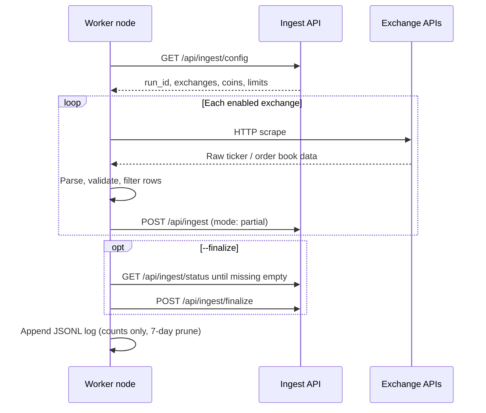
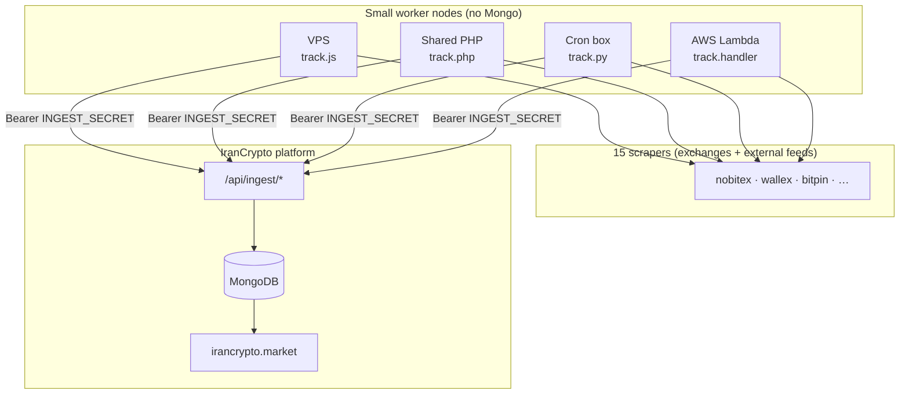
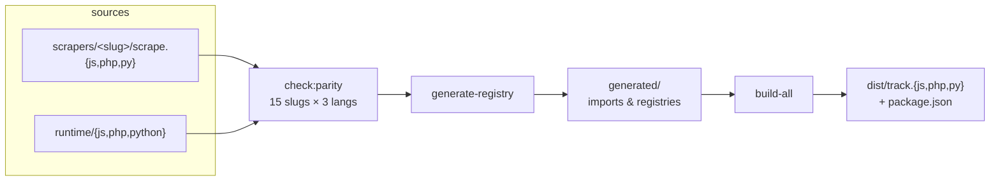

# IranCrypto Tracker

[](https://github.com/davodm/irancrypto-tracker/actions/workflows/ci.yml)
[](https://github.com/davodm/irancrypto-tracker/actions/workflows/release.yml)


Lightweight **exchange collectors** for [IranCrypto.market](https://irancrypto.market). Each worker scrapes prices from Iranian and global sources, then POSTs normalized rows to the site **ingest API**. Workers never touch MongoDB — only `INGEST_SECRET` is required (`INGEST_URL` defaults to `https://irancrypto.market/api/ingest`).

That split is intentional: you can run many small nodes (VPS, shared PHP hosting, a home cron box) without handing out database credentials. The platform owns persistence and market rebuilds; nodes only scrape and ship JSON.

---

## What we are building

| Layer | Responsibility |
|-------|----------------|
| **This repo (workers)** | Scrape exchanges → filter rows → POST to ingest → local JSONL logs |
| **Ingest API (site)** | Auth, archive upserts, run ledger, finalize → market / recap views |

Each deployable unit is **one file** (`track.js`, `track.php`, or `track.py`) plus an optional `logs/` directory. Pick the runtime that fits the host — same behavior, same CLI, same API contract. JS workers target **Node.js 24** (including AWS Lambda `nodejs24.x`).

---

## Runtime flow



All nodes for a given UTC hour share the same `run_id` (e.g. `2026-08-07T15`). See [How nodes work](#how-nodes-work).

---
## Architecture



**Security model:** workers hold ingest credentials (and optional per-exchange API keys). No `MONGO_URI`, no direct writes. TLS verification on by default (`SSL_VERIFY_INGEST=true`).

---

## Build pipeline

Source of truth lives in `scrapers/` (per-exchange logic) and `runtime/` (shared CLI, HTTP, orchestration). Build scripts assemble **single-file workers** into `dist/`.



| Step | Command | Output |
|------|---------|--------|
| Parity | `npm run check:parity` | Fails if any slug is missing JS, PHP, or Python |
| Generate | `npm run generate` | `generated/*` registries from `scrapers/` |
| Bundle JS | `npm run build:js` | `dist/track.js` via esbuild (Node 24+, no `node_modules` on worker) |
| Assemble PHP | `npm run build:php` | `dist/track.php` (PHP 8.2+ + curl) |
| Assemble Python | `npm run build:python` | `dist/track.py` (stdlib + urllib) |
| Full build | `npm run build` | All of the above |

CI runs parity → build → smoke `--help` → **freshness check** (committed `dist/` and `generated/` must match a fresh build). See [CONTRIBUTING.md](CONTRIBUTING.md).

---

## Deploy a worker

Copy **one** built file to the host. Download from [GitHub Releases](https://github.com/davodm/irancrypto-tracker/releases) or use the committed files in `dist/`.

```text
/opt/irancrypto-tracker/
  track.js | track.php | track.py
  package.json       # only needed for track.js (CommonJS)
  logs/              # auto-created at runtime — do not commit
  .env               # optional (INGEST_SECRET, INGEST_NODE, …)
```

### One-liner

Only `INGEST_SECRET` is required. `INGEST_URL` defaults to `https://irancrypto.market/api/ingest`.

```bash
INGEST_SECRET='your-secret' INGEST_NODE=vps-1 node track.js --all --finalize
```

```bash
INGEST_SECRET='your-secret' INGEST_NODE=liara-php php track.php --all --finalize
```

```bash
INGEST_SECRET='your-secret' INGEST_NODE=home-py python3 track.py --all --finalize
```

Override the ingest base for staging or a self-hosted API:

```bash
INGEST_URL=https://staging.example.com/api/ingest INGEST_SECRET='…' node track.js --all --finalize
```

Workers disable PHP/Python execution time limits where the runtime allows it, so long scrape runs are not cut off by default.

### How nodes work

Think in **UTC hours**, not “clock sync between machines.”

Every run uses `run_id = YYYY-MM-DDTHH` (current UTC hour). The ingest API treats that hour as one collection bucket:

1. Each `POST /api/ingest` for a source **replaces** that source’s rows for the hour (not append forever). Same exchange posted twice → last successful POST wins.
2. The API ledger tracks which exchange slugs arrived (`expected` vs `received` / `missing`).
3. `POST /api/ingest/finalize` rebuilds market views from the archive for that hour. It **refuses** if any expected source is still missing (unless ops force). After finalize, further POSTs for that hour are rejected.

#### Roles

| Role | What it runs | Purpose |
|------|----------------|---------|
| **Finalizer (one)** | `--all --finalize` | Scrapes every exchange, then waits for a complete hour, then finalizes. Usually AWS Lambda once per hour. |
| **Scraper (zero or more)** | `--all` **without** `--finalize` | Extra scrapes for the same hour. Backup if Lambda fails an exchange, or a second network path. Never finalizes. |

Finalize is **not** what prevents duplicate ticks — hour replace on each POST does. Finalize only rebuilds the public market tables once the hour’s sources are in.

#### What Lambda actually does each hour

Example: EventBridge at minute `:05` UTC, `FINALIZE_WAIT_SEC=300` (5 minutes).

1. Scrape all exchanges → POST each source for this hour’s `run_id`.
2. Poll `GET /api/ingest/status`:
   - If every expected source is already received → finalize immediately.
   - If some are still `missing` → keep polling for up to **5 minutes**, hoping a scraper node posts those sources.
3. When `missing: []` → `POST /finalize`.
4. If still missing after the wait → exit with error (hour not finalized; fix scrapers / raise wait / rerun).

So `FINALIZE_WAIT_SEC` is **not** “satellites run every 5 minutes.” It is only **how long the finalizer is willing to wait for missing sources after its own scrape**. Default 300s is a short grace window so a VPS that started a bit earlier (or finished a slow exchange) can still fill gaps before markets rebuild.

#### How scraper schedules fit

Scrapers help the **same** `run_id` only if they POST **before** the finalizer completes step 3.

Recommended pattern:

| Node | Schedule (UTC) | Flags |
|------|----------------|--------|
| Scraper(s) | `:00` (or `:02`) each hour | `--all` |
| Lambda finalizer | `:05` each hour | `--all --finalize`, wait ≤ 5 min |

Then scrapers usually finish posting before Lambda finalizes (~`:05`–`:10`).

If a scraper runs every 30 minutes at `:00` and `:30`:

- `:00` → helps the current hour (good).
- `:30` → same hour is often **already finalized** → API returns 409; that run does nothing useful for that hour. Prefer hourly scrapers aligned before the finalizer, or only use `:00`.

You do **not** need scrapers at all if Lambda alone is reliable — then `missing` is empty after Lambda’s own POSTs and the wait is effectively zero.

| Env | Default | Meaning |
|-----|---------|---------|
| `INGEST_NODE` | hostname / Lambda name | Label in ledger + logs (use a unique name per host) |
| `FINALIZE_WAIT_SEC` | `300` | Finalizer only: max seconds to wait for `missing: []` |
| `FINALIZE_POLL_SEC` | `15` | Finalizer only: status poll interval while waiting |

### Cron (scraper nodes)

Scrape only — **no** `--finalize`:

```cron
0 * * * * cd /opt/irancrypto-tracker && INGEST_SECRET='your-secret' INGEST_NODE=vps-1 /usr/bin/node track.js --all >> /var/log/irancrypto-tracker.log 2>&1
```

```cron
0 * * * * cd /opt/irancrypto-tracker && INGEST_SECRET='your-secret' INGEST_NODE=liara-php /usr/bin/php track.php --all >> /var/log/irancrypto-tracker.log 2>&1
```

```cron
0 * * * * cd /opt/irancrypto-tracker && INGEST_SECRET='your-secret' INGEST_NODE=home-py /usr/bin/python3 track.py --all >> /var/log/irancrypto-tracker.log 2>&1
```

Or put secrets in `.env` and keep the cron line minimal:

```cron
0 * * * * cd /opt/irancrypto-tracker && /usr/bin/node track.js --all >> /var/log/irancrypto-tracker.log 2>&1
```

### AWS Lambda (recommended finalizer)

`track.js` ships an **async** `track.handler` (required on Node.js 24 — no callback handlers). Default: `--all --finalize` (scrape → status wait → finalize).

**Package & upload:**

```bash
npm run build
npm run lambda:package    # writes irancrypto-tracker-lambda.zip
```

Zip contents: `track.js` + `package.json` (~620 KB). No `node_modules`.

| Setting | Value |
|---------|--------|
| Runtime | **Node.js 24.x** (`nodejs24.x`) |
| Handler | `track.handler` |
| Timeout | **900 s** (scrape + up to `FINALIZE_WAIT_SEC`) |
| Memory | 512 MB+ |
| Reserved concurrency | **1** |
| IAM | `AWSLambdaBasicExecutionRole` (CloudWatch Logs only) |

**Environment:**

```text
INGEST_SECRET=your-secret
INGEST_NODE=irancrypto-lambda
LOG_DIR=/tmp/irancrypto-logs
TRACK_ARGS=--all --finalize
FINALIZE_WAIT_SEC=300
FINALIZE_POLL_SEC=15
```

**Schedule (EventBridge):** `cron(5 * * * ? *)` → this function, input `{}` (minute 5 so scrapers at `:00` can finish first).

Default event `{}` runs `--all --finalize`. Optional payloads:

```json
{ "exchange": "nobitex" }
{ "exchange": "nobitex", "finalize": true }
{ "finalize_only": true, "run_id": "2026-08-07T10" }
{ "dry_run": true }
```

**Test after deploy:**

```bash
aws lambda invoke --function-name irancrypto-tracker --payload '{}' /tmp/out.json && cat /tmp/out.json
```

Expect `{ "ok": true, "exitCode": 0 }`. Logs go to CloudWatch; JSONL under `/tmp/irancrypto-logs` is ephemeral. If `--all` exceeds 15 minutes, split scrapes with `EXCHANGES` across hosts and keep **one** finalizer.

Full env reference: [.env.example](.env.example).

---

## Repository layout

```text
scrapers/<slug>/
  scrape.js          # PLATFORM, COIN_USE, scrape()
  scrape.php         # parse job + register_<slug>()
  scrape.py          # parse job + register_<slug>()
  sample.json        # raw API response dump for debugging parsers
runtime/
  js/                # entry, HTTP, ingest client (bundled into track.js)
  php/               # boot, helpers, orchestrator
  python/            # helpers, orchestrator
scripts/             # parity, generate-registry, build-*
generated/           # auto registries (committed, CI-checked)
dist/                # shippable workers (committed + release assets)
fixtures/parse/      # small golden fixtures for CI parse checks
```

**Add an exchange:** create `scrapers/<newslug>/` with all three scrape files (+ `sample.json`) → `npm run build` → commit `generated/` + `dist/`.

---

## Develop locally

```bash
npm ci
npm run check:parity
npm run build
npm run dev                    # dry-run JS entry with dotenv
node dist/track.js --exchange=nobitex --dry-run
```

| Script | Purpose |
|--------|---------|
| `npm run build` | Parity → generate → js / php / python |
| `npm run build:js` | Bundle `dist/track.js` only |
| `npm run build:php` | Assemble `dist/track.php` |
| `npm run build:python` | Assemble `dist/track.py` |
| `npm run dev` | Dry-run modular JS entry |
| `npm run track` | Run built `dist/track.js` |
| `npm start` | `dist/track.js --all --finalize` |

---

## CLI

```text
track --all [--finalize]
track --exchange=nobitex
track --finalize-only [--run-id=YYYY-MM-DDTHH]
track --from-json=rows.json
track --prune-logs
track --dry-run …
```

---

## Releases

Tags on **main** only. Version must match `package.json`.

```bash
npm version patch          # or minor / major
git push origin main --follow-tags
```

The release workflow builds fresh workers, writes a changelog since the previous tag, and attaches `track.js`, `track.php`, and `track.py` to the GitHub Release. See [CONTRIBUTING.md](CONTRIBUTING.md) for adding scrapers.

---

## Security notes

- Workers need `INGEST_SECRET` only — no database URI on scrape hosts.
- Ingest requests use `Authorization: Bearer …`; enable TLS verify in production.
- Local logs record counts and timing, not secrets; pruned after 7 days by default.
- Exchange API keys (where required) stay in env on the node that needs them.
