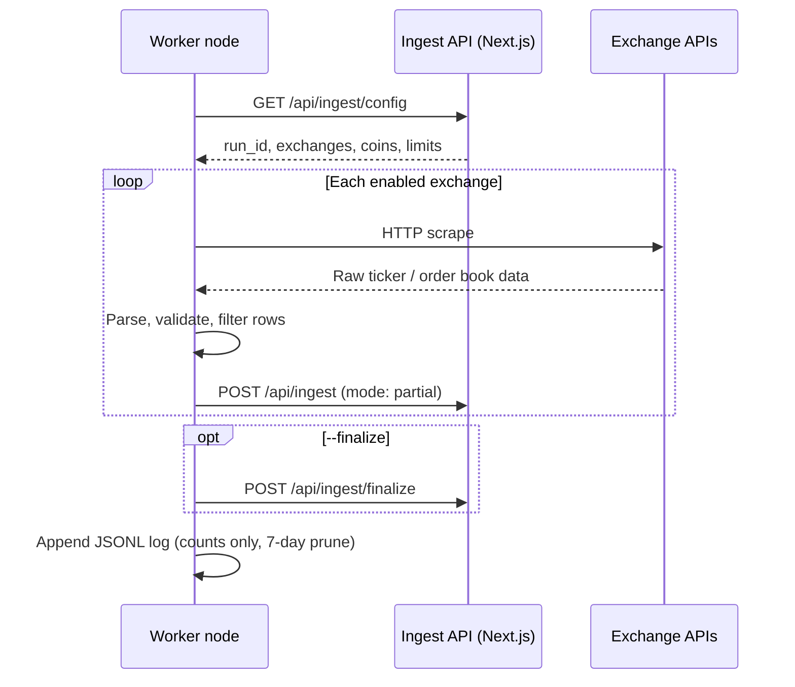
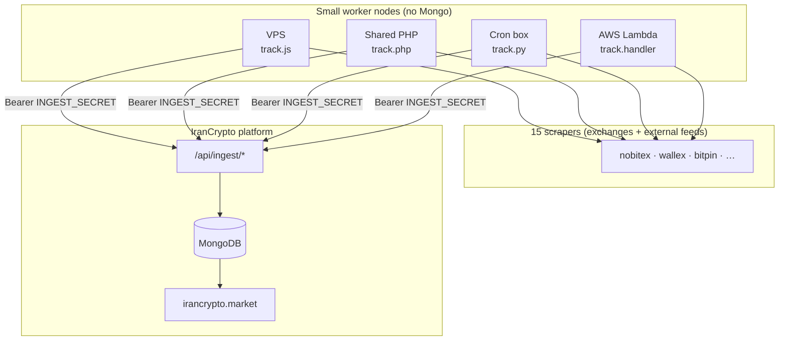
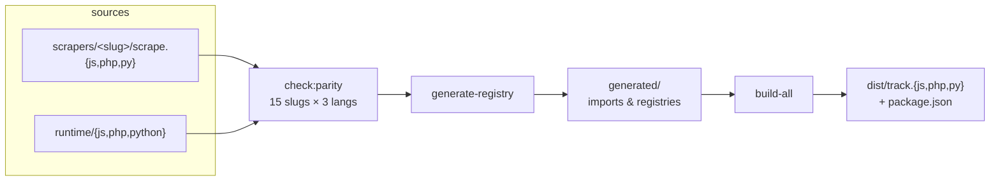

# IranCrypto Tracker

[](https://github.com/davodm/irancrypto-tracker/actions/workflows/ci.yml)
[](https://github.com/davodm/irancrypto-tracker/actions/workflows/release.yml)


Lightweight **exchange collectors** for [IranCrypto.market](https://irancrypto.market). Each worker scrapes prices from Iranian and global sources, then POSTs normalized rows to the Next.js **ingest API**. Workers never touch MongoDB — only `INGEST_SECRET` is required (`INGEST_URL` defaults to `https://irancrypto.market/api/ingest`).

That split is intentional: you can run many small nodes (VPS, shared PHP hosting, a home cron box) without handing out database credentials. The platform owns persistence, dedup, and market rebuilds; nodes only scrape and ship JSON.

---

## What we are building

| Layer | Responsibility |
|-------|----------------|
| **This repo** | Scrape exchanges → filter rows → POST to ingest → local JSONL logs |
| **irancrypto-nextjs** | Config, auth, archive upserts, run ledger, finalize → `exchangemarket` / recaps |

Each deployable unit is **one file** (`track.js`, `track.php`, or `track.py`) plus an optional `logs/` directory. Pick the runtime that fits the host — same behavior, same CLI, same API contract.

---

## Runtime flow



Multi-node runs share the same hourly `run_id`. The API tracks which sources arrived; `GET /api/ingest/status` helps coordinate before finalize. Ingest route details live on the Next.js site.

---

## Architecture



**Security model:** workers hold ingest credentials (and optional per-exchange API keys). No `MONGO_URI`, no direct writes. TLS verification on by default (`SSL_VERIFY_INGEST=true`).

---

## Build pipeline

Source of truth lives in `scrapers/` (per-exchange logic) and `runtime/` (shared CLI, HTTP, orchestration). Build scripts assemble **single-file workers** into `dist/`.



| Step | Command | Output |
|------|---------|--------|
| Parity | `npm run check:parity` | Fails if any slug is missing JS, PHP, or Python |
| Generate | `npm run generate` | `generated/*` registries from `scrapers/` |
| Bundle JS | `npm run build:js` | `dist/track.js` via esbuild (Node 18+, no `node_modules` on worker) |
| Assemble PHP | `npm run build:php` | `dist/track.php` (PHP 8.2+ + curl) |
| Assemble Python | `npm run build:python` | `dist/track.py` (stdlib + urllib) |
| Full build | `npm run build` | All of the above |

CI runs parity → build → smoke `--help` → **freshness check** (committed `dist/` and `generated/` must match a fresh build). See [CONTRIBUTING.md](CONTRIBUTING.md).

---

## Deploy a worker

Copy **one** built file to the host. Download from [GitHub Releases](https://github.com/davodm/irancrypto-tracker/releases) or use the committed files in `dist/`.

```text
/opt/irancrypto-tracker/
  track.js | track.php | track.py
  package.json       # only needed for track.js (CommonJS)
  logs/              # auto-created at runtime — do not commit
  .env               # optional (INGEST_SECRET, INGEST_NODE, …)
```

### One-liner

Only `INGEST_SECRET` is required. `INGEST_URL` defaults to `https://irancrypto.market/api/ingest`.

```bash
INGEST_SECRET='your-secret' INGEST_NODE=vps-1 node track.js --all --finalize
```

```bash
INGEST_SECRET='your-secret' INGEST_NODE=liara-php php track.php --all --finalize
```

```bash
INGEST_SECRET='your-secret' INGEST_NODE=home-py python3 track.py --all --finalize
```

Override the ingest base for staging or self-hosted Next.js:

```bash
INGEST_URL=https://staging.example.com/api/ingest INGEST_SECRET='…' node track.js --all --finalize
```

Workers disable PHP/Python execution time limits where the runtime allows it, so long scrape runs are not cut off by default.

### Cron (hourly collection)

Run at minute 5 each hour UTC (adjust path and runtime to match your host):

```cron
5 * * * * cd /opt/irancrypto-tracker && INGEST_SECRET='your-secret' INGEST_NODE=vps-1 /usr/bin/node track.js --all --finalize >> /var/log/irancrypto-tracker.log 2>&1
```

```cron
5 * * * * cd /opt/irancrypto-tracker && INGEST_SECRET='your-secret' INGEST_NODE=liara-php /usr/bin/php track.php --all --finalize >> /var/log/irancrypto-tracker.log 2>&1
```

```cron
5 * * * * cd /opt/irancrypto-tracker && INGEST_SECRET='your-secret' INGEST_NODE=home-py /usr/bin/python3 track.py --all --finalize >> /var/log/irancrypto-tracker.log 2>&1
```

Alternatively, put `INGEST_SECRET` and `INGEST_NODE` in `/opt/irancrypto-tracker/.env` and keep the cron line minimal:

```cron
5 * * * * cd /opt/irancrypto-tracker && /usr/bin/node track.js --all --finalize >> /var/log/irancrypto-tracker.log 2>&1
```

### AWS Lambda (EventBridge schedule)

`track.js` ships a Lambda handler — no VPS cron needed. Same pipeline as `--all --finalize`.

**Package & upload:**

```bash
npm run build
npm run lambda:package    # writes irancrypto-tracker-lambda.zip
```

Zip contents: `track.js` + `package.json` (~620 KB). No `node_modules`.

| Setting | Value |
|---------|--------|
| Runtime | Node.js 20.x or 22.x |
| Handler | `track.handler` |
| Timeout | **900 s** (15 min — scraping all sources needs headroom) |
| Memory | 512 MB+ |
| IAM | `AWSLambdaBasicExecutionRole` (CloudWatch Logs only) |

**Environment:**

```text
INGEST_SECRET=your-secret          # required (same as Next.js)
INGEST_NODE=irancrypto-lambda      # optional (defaults to function name)
LOG_DIR=/tmp/irancrypto-logs       # optional (auto-set on Lambda)
TRACK_ARGS=--all --finalize        # optional CLI override
```

**Schedule (EventBridge):** `cron(5 * * * ? *)` → this function, input `{}`.

Default event `{}` runs `--all --finalize`. Optional payloads:

```json
{ "exchange": "nobitex" }
{ "exchange": "nobitex", "finalize": true }
{ "finalize_only": true, "run_id": "2026-08-07T10" }
{ "dry_run": true }
```

**Test after deploy:**

```bash
aws lambda invoke --function-name irancrypto-tracker --payload '{}' /tmp/out.json && cat /tmp/out.json
```

Expect `{ "ok": true, "exitCode": 0 }`. Logs go to CloudWatch; JSONL under `/tmp/irancrypto-logs` is ephemeral. If `--all` exceeds 15 minutes, split with `EXCHANGES` allow-lists across multiple functions.

Full env reference: [.env.example](.env.example).

---

## Repository layout

```text
scrapers/<slug>/
  scrape.js          # PLATFORM, COIN_USE, scrape()
  scrape.php         # parse job + register_<slug>()
  scrape.py          # parse job + register_<slug>()
  sample.json        # raw API response dump for debugging parsers
runtime/
  js/                # entry, HTTP, ingest client (bundled into track.js)
  php/               # boot, helpers, orchestrator
  python/            # helpers, orchestrator
scripts/             # parity, generate-registry, build-*
generated/           # auto registries (committed, CI-checked)
dist/                # shippable workers (committed + release assets)
fixtures/parse/      # small golden fixtures for CI parse checks
```

**Add an exchange:** create `scrapers/<newslug>/` with all three scrape files (+ `sample.json`) → `npm run build` → commit `generated/` + `dist/`.

---

## Develop locally

```bash
npm ci
npm run check:parity
npm run build
npm run dev                    # dry-run JS entry with dotenv
node dist/track.js --exchange=nobitex --dry-run
```

| Script | Purpose |
|--------|---------|
| `npm run build` | Parity → generate → js / php / python |
| `npm run build:js` | Bundle `dist/track.js` only |
| `npm run build:php` | Assemble `dist/track.php` |
| `npm run build:python` | Assemble `dist/track.py` |
| `npm run dev` | Dry-run modular JS entry |
| `npm run track` | Run built `dist/track.js` |
| `npm start` | `dist/track.js --all --finalize` |

---

## CLI

```text
track --all [--finalize]
track --exchange=nobitex
track --finalize-only [--run-id=YYYY-MM-DDTHH]
track --from-json=rows.json
track --prune-logs
track --dry-run …
```

---

## Releases

Tags on **main** only. Version must match `package.json`.

```bash
npm version patch          # or minor / major
git push origin main --follow-tags
```

The release workflow builds fresh workers, writes a changelog since the previous tag, and attaches `track.js`, `track.php`, and `track.py` to the GitHub Release. See [CONTRIBUTING.md](CONTRIBUTING.md) for adding scrapers.

---

## Security notes

- Workers need `INGEST_SECRET` only — no database URI on scrape hosts.
- Ingest requests use `Authorization: Bearer …`; enable TLS verify in production.
- Local logs record counts and timing, not secrets; pruned after 7 days by default.
- Exchange API keys (where required) stay in env on the node that needs them.
