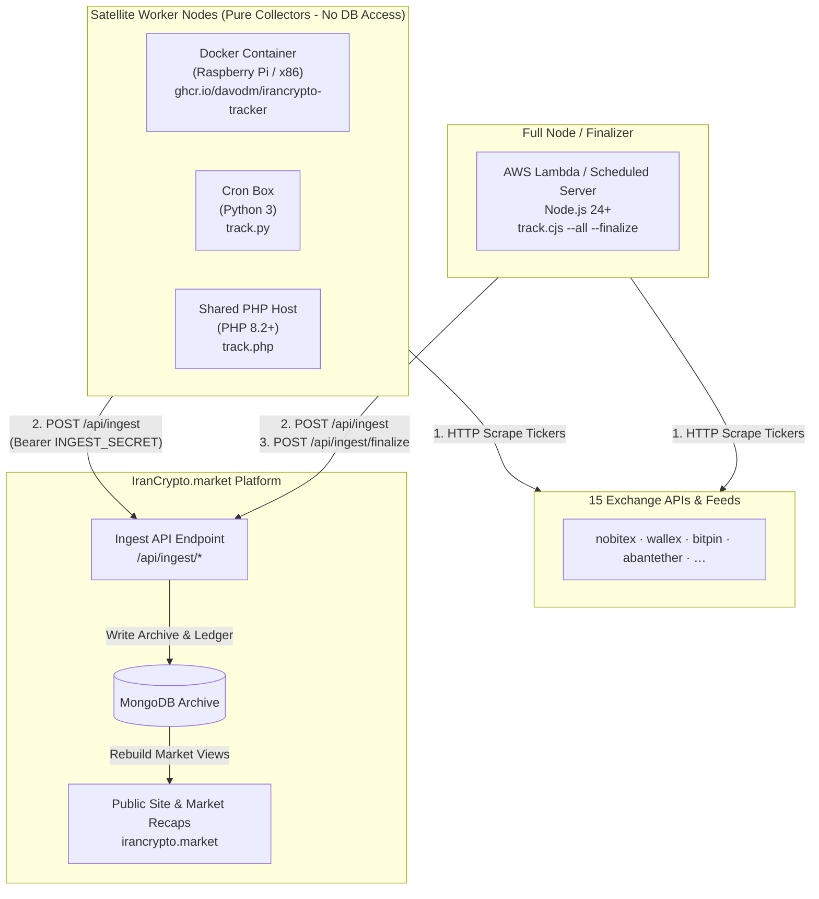
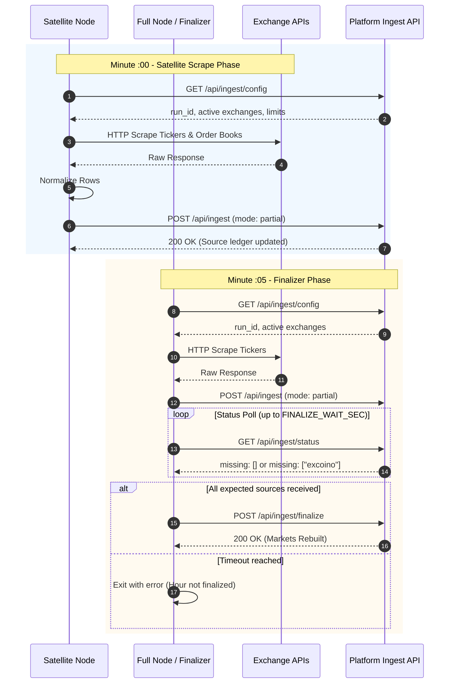

# IranCrypto Tracker

[](https://github.com/davodm/irancrypto-tracker/actions/workflows/ci.yml)
[](https://github.com/davodm/irancrypto-tracker/actions/workflows/docker.yml)
[](https://github.com/davodm/irancrypto-tracker/actions/workflows/release.yml)
[](LICENSE)


**IranCrypto Tracker** is a lightweight, high-availability market data collection system powering [IranCrypto.market](https://irancrypto.market). It periodically fetches real-time ticker prices, order books, and 24-hour trading volumes across 15 Iranian cryptocurrency exchanges and global data feeds, standardizes raw payloads into a unified schema, and securely ships them to the platform **Ingest API**.

---

## Key Features & Design Philosophy

- **Zero Database Access on Scraper Nodes**: Worker nodes **never** connect to MongoDB or hold database credentials. Nodes only require an `INGEST_SECRET` bearer token and standard outbound HTTPS access.
- **Multi-Language Single-File Workers**: Every collection pass can be executed via Node.js (`track.cjs`), PHP (`track.php`), or Python (`track.py`). All three runtimes implement identical CLI flags, HTTP behavior, and parsing rules.
- **Ultra-Compact Docker Satellites**: Pre-built multi-architecture Docker images (`amd64` and `arm64`) compiled down to zero-dependency executables (< 40 MB image size, ~15 MB RAM overhead).
- **Decoupled & Fault-Tolerant Architecture**: Multiple scraping nodes (VPS, home servers, shared hosting, Raspberry Pi) can submit metrics for the same hour. The central Ingest API manages atomic hourly deduplication and ledger state.

---

## Workflow & System Architecture

### How We Work

System telemetry operates in **UTC hourly buckets** identified by a `run_id` (e.g. `2026-08-08T00`).

```text
Scrape Phase (Minute :00 - :05) ──► Ingest Partial Payload ──► Status Verification & Wait ──► Finalize & Rebuild Markets
```

1. **Scrape & Normalize**: Worker nodes query enabled exchange endpoints, parse raw tickers, filter out invalid rows, and normalize data into standard fields (`symbol`, `currency`, `price`, `volume_1d`, `source`).
2. **Atomic Ingestion**: Nodes POST normalized rows to `/api/ingest`. For a given `run_id`, subsequent submissions from any node for an exchange **replace** that exchange's rows for the hour (last successful POST wins).
3. **Ledger Tracking**: The central Ingest API tracks expected vs received sources for the active hour.
4. **Finalization & Market Rebuild**: A designated **Full Node / Finalizer** issues a `POST /api/ingest/finalize`. Upon finalization, the platform rebuilds public market indexes and recap views from the hourly archive.

---

### Node Roles

| Role | Execution Command | Description & Operational Pattern |
|------|-------------------|----------------------------------|
| **Full Node / Finalizer** | `--all --finalize` | **One per hour**. Scrapes all sources, polls `/api/ingest/status` until all expected exchange sources arrive (or until `FINALIZE_WAIT_SEC` elapses), then triggers `POST /finalize`. Typically deployed as an **AWS Lambda function** (scheduled at `:05` UTC) or primary server. |
| **Satellite Nodes** | `--all` | **Zero or more**. Distributed collector nodes running on VPS hosts, home servers (Raspberry Pi), shared PHP hosts, or Docker containers. Submits partial source data to fill potential network gaps before finalization. Never issues finalize calls. |
| **Ingest API (Platform)** | central web service | Handles authentication, payload validation, hourly payload replacements, persistent archival in MongoDB, and market index generation. |

---

### System Architecture Diagram



---

### Hourly Collection Sequence



---

## Setup, Installation & Operation

### Option A: Docker & Docker Compose (Recommended Satellite)

Multi-architecture images (`linux/amd64` and `linux/arm64`) are automatically published to **GitHub Container Registry (GHCR)**. Ideal for Raspberry Pi (3B+/4/5 running 64-bit OS), Linux VPS, Windows, or Apple Silicon.

#### 1. Quickstart with Pre-built Image

Create a `.env` file:

```bash
cat << 'EOF' > .env
INGEST_SECRET=your-ingest-secret-key
INGEST_NODE=satellite-docker-01
EOF
```

Download `docker-compose.yml` and start the satellite container:

```bash
curl -fsSL -O https://raw.githubusercontent.com/davodm/irancrypto-tracker/main/docker-compose.yml
docker compose up -d
```

Or run directly with `docker run`:

```bash
docker run -d \
  --name irancrypto-tracker \
  --restart unless-stopped \
  --env-file .env \
  ghcr.io/davodm/irancrypto-tracker:latest
```

#### 2. Build Locally from Source Code

```bash
git clone https://github.com/davodm/irancrypto-tracker.git
cd irancrypto-tracker
cp .env.example .env
# Edit .env with your INGEST_SECRET
docker compose up -d --build
```

The container executes a scrape pass upon startup, sleeps for 1 hour (3600s), and automatically resumes.

---

### Option B: Standalone Single-File Workers (JS / PHP / Python)

Single-file worker bundles live in `dist/` and can be downloaded from [GitHub Releases](https://github.com/davodm/irancrypto-tracker/releases).

```text
/opt/irancrypto-tracker/
  ├── track.cjs          # Single-file Node.js CommonJS bundle
  ├── track.php          # Single-file PHP 8.2+ script
  ├── track.py           # Single-file Python 3 standard library script
  └── .env               # Environment configuration
```

#### Running Workers via CLI

**Node.js (Node 24+ required):**
```bash
INGEST_SECRET='your-secret' INGEST_NODE=vps-node node track.cjs --all
```

**PHP (PHP 8.2+ with cURL extension):**
```bash
INGEST_SECRET='your-secret' INGEST_NODE=vps-php php track.php --all
```

**Python (Python 3.8+ stdlib):**
```bash
INGEST_SECRET='your-secret' INGEST_NODE=vps-py python3 track.py --all
```

#### Satellite Cron Example (Hourly Scraper)

Add an entry to `crontab -e` on your scraping host (scheduled at `:00` UTC):

```cron
0 * * * * cd /opt/irancrypto-tracker && INGEST_SECRET='your-secret' INGEST_NODE=vps-cron /usr/bin/node track.cjs --all >> /var/log/irancrypto.log 2>&1
```

---

### Option C: AWS Lambda Function (Recommended Finalizer)

The Node.js worker (`track.cjs`) exposes an async entry point (`track.handler`) designed for **AWS Lambda (Node.js 24.x)**.

#### Packaging & Deployment

1. **Build and package Lambda ZIP**:
   ```bash
   npm run build
   npm run lambda:package
   ```
   This generates `irancrypto-tracker-lambda.zip` (~620 KB, zero `node_modules`).

2. **Upload to AWS Lambda**:
   - **Runtime**: `Node.js 24.x` (`nodejs24.x`)
   - **Handler**: `track.handler`
   - **Timeout**: `900 seconds` (15 minutes)
   - **Memory**: `512 MB+`
   - **Reserved Concurrency**: `1`

3. **Configure Lambda Environment Variables**:
   ```text
   INGEST_SECRET=your-secret-key
   INGEST_NODE=aws-lambda-finalizer
   TRACK_ARGS=--all --finalize
   FINALIZE_WAIT_SEC=300
   FINALIZE_POLL_SEC=15
   LOG_DIR=/tmp/irancrypto-logs
   ```

4. **EventBridge Schedule**: `cron(5 * * * ? *)` (Triggers hourly at minute `:05` UTC).

---

### Environment Variables Reference

| Variable | Default | Purpose |
|----------|---------|---------|
| `INGEST_SECRET` | *(Required)* | Bearer authentication secret key for Ingest API |
| `INGEST_URL` | `https://irancrypto.market/api/ingest` | Base URL of platform Ingest API |
| `INGEST_NODE` | system hostname / Lambda name | Identifier label recorded in ingest ledger logs |
| `FINALIZE_WAIT_SEC` | `300` | Finalizer only: Max seconds to wait for missing sources before finalizing |
| `FINALIZE_POLL_SEC` | `15` | Finalizer only: Poll interval (seconds) while awaiting missing sources |
| `SSL_VERIFY_INGEST` | `true` | Set to `false` to disable SSL certificate checks (staging environments) |
| `LOG_DIR` | `./logs` | Directory for writing JSONL execution logs |
| `TRACK_ARGS` | `--all` | Default CLI argument flags for execution |

---

## Development & Contribution

### Developer Setup

```bash
# Install development dependencies
npm ci

# Run parity check across JS, PHP, and Python scrapers
npm run check:parity

# Build registries and bundle single-file workers into dist/
npm run build

# Dry-run local JS development entry point
npm run dev
```

### Adding New Exchange Scrapers

All exchange scrapers must maintain strict **three-language parity** across JavaScript, PHP, and Python.

For step-by-step instructions on creating scraper files, registering modules, row schema definitions, and submitting pull requests, please read the [CONTRIBUTING.md](CONTRIBUTING.md) guide.

---

## License

This project is open-source software licensed under the **GNU Affero General Public License v3.0** ([AGPL-3.0-or-later](LICENSE)).

### Short License Summary

- **Copyleft for Network Services**: If you run a modified version of IranCrypto Tracker on a server or network service, you **must** make the complete source code of your modified version available to all network users under the AGPL v3 license.
- **Freedom & Modifications**: You are free to inspect, modify, adapt, and distribute this software, provided all modifications retain AGPL v3 copyleft terms and copyright notices.
- See the full license text in the [LICENSE](LICENSE) file.
